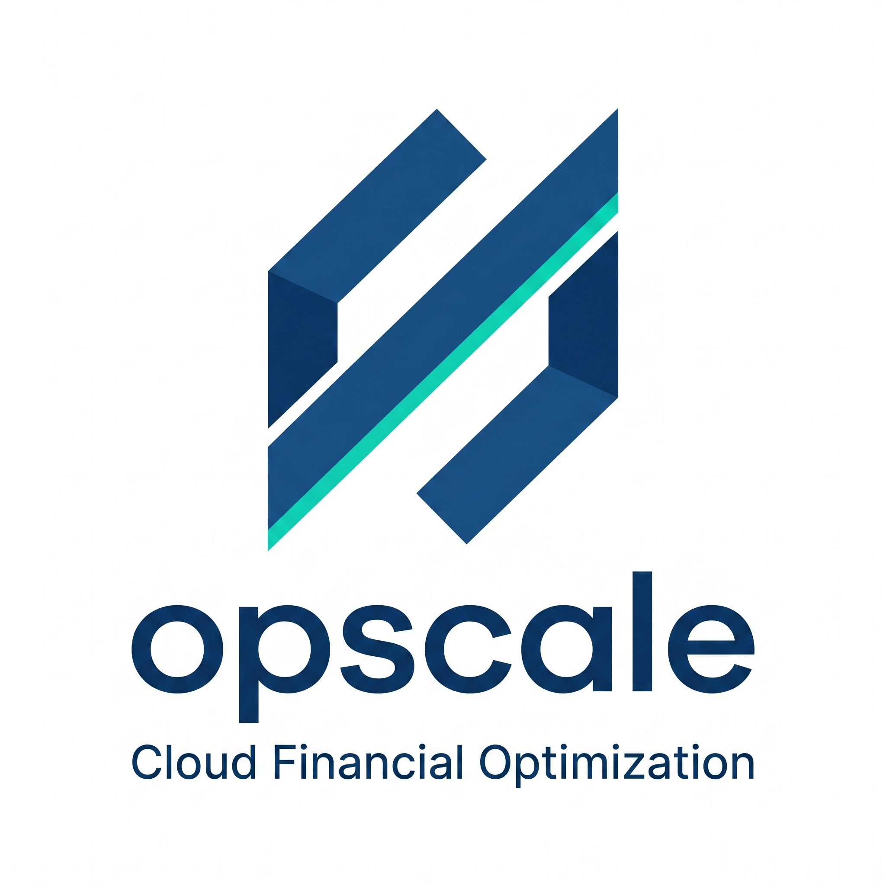
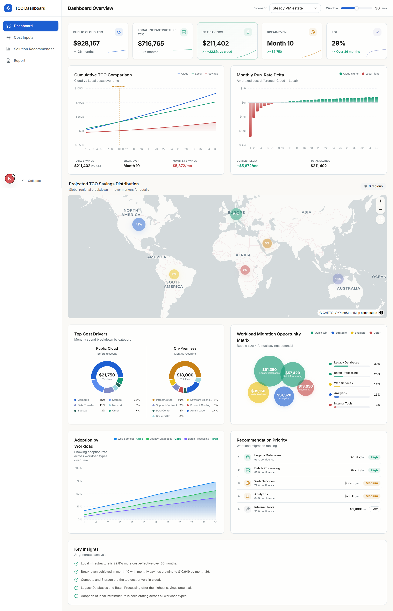
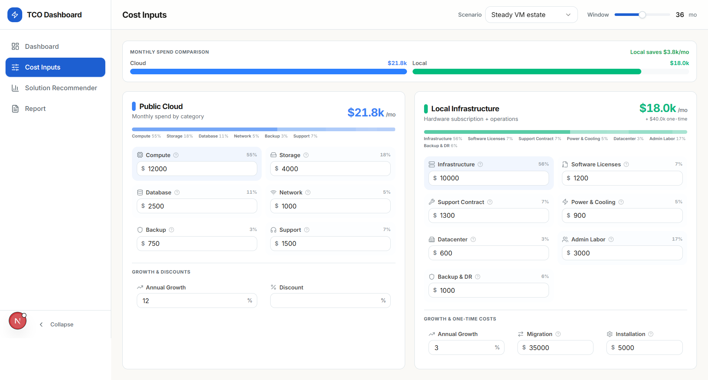
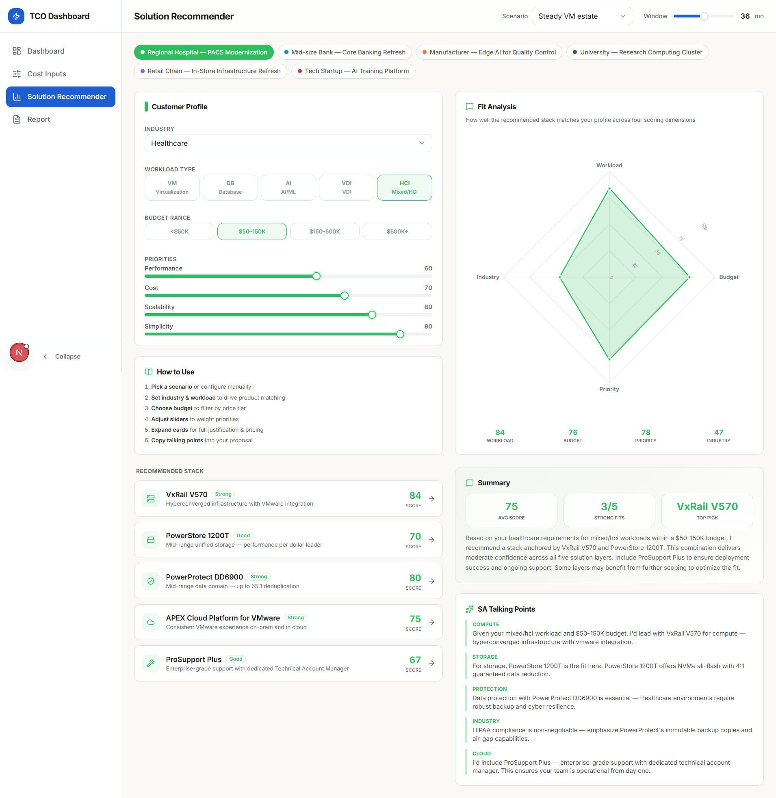
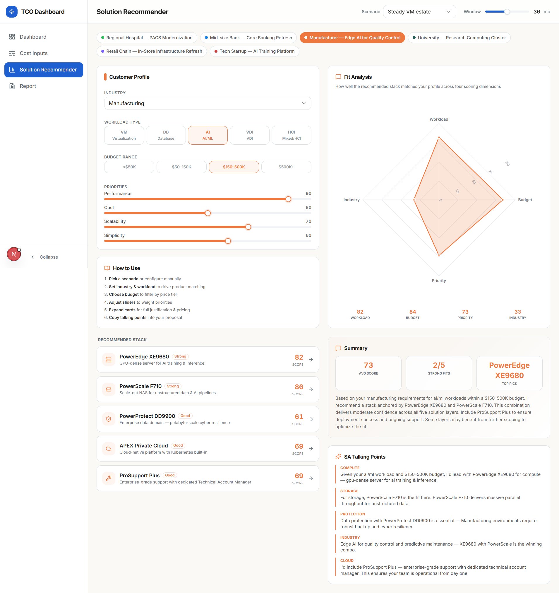
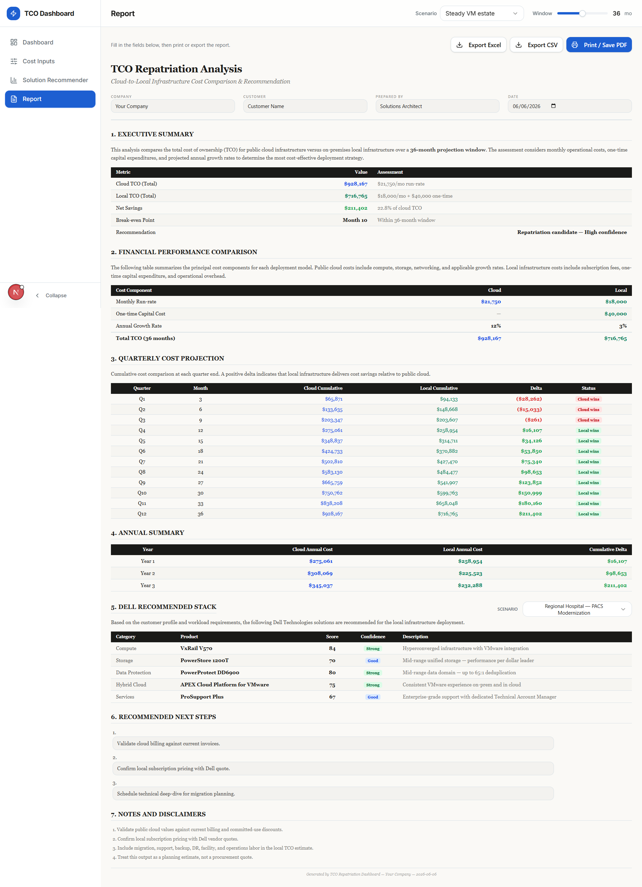
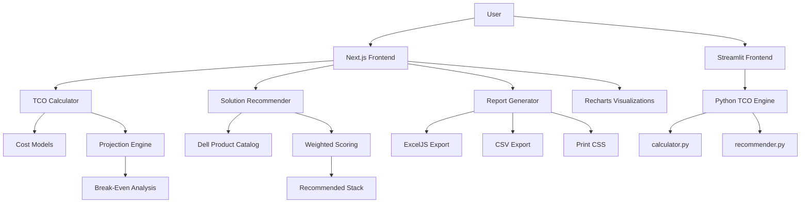

<div align="center">



### Cloud Financial Optimization

**A presales dashboard for comparing public cloud TCO against local infrastructure — with Dell Technologies solution recommendations.**

[](https://nextjs.org)
[](https://react.dev)
[](https://typescriptlang.org)
[](https://tailwindcss.com)
[](https://python.org)
[](https://streamlit.io)
[](LICENSE)

### [Live Demo →](https://frontend-iota-ten-60.vercel.app)

[Features](#-key-features) • [Screenshots](#-screenshots) • [Quick Start](#-quick-start) • [Architecture](#-architecture) • [Documentation](#-documentation)

</div>

---

## Overview

**Opscale — TCO Repatriation Dashboard** is a portfolio-grade presales tool built for Dell Technologies Inside Solutions Architects. It answers the question every infrastructure conversation starts with:

> *"Should this workload stay in the cloud, move on-prem, or run hybrid?"*

The project ships two fully functional frontends — a modern **Next.js / React** app (primary) and a legacy **Streamlit** app — both powered by the same tested calculation engine. It includes interactive financial dashboards, a Dell product solution recommender, and print-ready executive reports with Excel export.

---

## Key Features

### Financial Analysis
- **TCO Projection Engine** — Month-by-month cost comparison over 12–60 months with compounding growth rates
- **Break-Even Analysis** — Automatically identifies the month where local infrastructure becomes cheaper than cloud
- **Cumulative Cost Charts** — Interactive line charts, bar deltas, and sparkline KPIs built with Recharts
- **Global Savings Map** — World map visualization showing regional savings distribution via MapLibre GL

### Dell Solution Recommender
- **Weighted Scoring Engine** — Scores Dell products across 4 dimensions: Workload fit (40%), Budget fit (25%), Priority fit (20%), Industry bonus (15%)
- **6 Pre-built Customer Scenarios** — Healthcare, Banking, Manufacturing, Education, Retail, and Tech Startup profiles
- **Radar Chart Fit Analysis** — Visual breakdown of how well the recommended stack matches the customer profile
- **SA Talking Points** — Auto-generated, category-specific selling points ready for customer proposals

### Report & Export
- **Professional Document-Style Report** — Numbered sections, executive summary tables, quarterly projections, and annual summaries (Georgia serif typography)
- **Print-to-PDF** — Full A4-optimized print CSS with proper overflow handling, page breaks, and color-accurate rendering
- **Excel Export (5 sheets)** — Summary, Cost Comparison, Quarterly Projection, Yearly Summary, and Monthly Projection via ExcelJS
- **CSV Export** — Lightweight text export for data pipelines

### Dashboard
- **10+ Interactive Visualizations** — Cumulative TCO, monthly run-rate delta, cost composition donuts, migration opportunity matrix, adoption trends, recommendation priority rankings
- **AI-Generated Key Insights** — Automatic narrative analysis of cost drivers and savings opportunities
- **Collapsible Sidebar Navigation** — 4 sections: Dashboard, Cost Inputs, Solution Recommender, Report

### UX & Design
- **shadcn/ui Components** — Radix primitives with Tailwind styling for consistent, accessible UI
- **Responsive Layout** — Sidebar collapse, scenario presets, projection window slider
- **Zero Backend Required** — Fully client-side static export (`output: "export"`), deployable anywhere

---

## Screenshots

### Dashboard Overview
Interactive KPIs, cumulative cost charts, global savings map, cost driver breakdown, and workload migration analysis.



### Cost Inputs
Side-by-side cloud vs. local infrastructure cost configuration with category-level detail, growth rates, and one-time costs.



### Solution Recommender
Customer profile configuration, weighted scoring radar chart, Dell product stack recommendations, and SA talking points.





### Report
Professional document-style output with executive summary, financial tables, quarterly projections, and Dell recommended stack.



---

## Quick Start

### Next.js Frontend (Primary)

```bash
# Navigate to the frontend directory
cd frontend

# Install dependencies
npm install

# Start development server
npm run dev
```

Open [http://localhost:3000](http://localhost:3000)

```bash
# Production build (static export)
npm run build

# The static site is output to frontend/out/
```

### Streamlit App (Legacy)

```powershell
# Create and activate virtual environment
python -m venv .venv
.\.venv\Scripts\Activate.ps1

# Install dependencies
pip install -r requirements.txt

# Run the Streamlit app
streamlit run app.py --server.port 8502
```

Open [http://localhost:8502](http://localhost:8502)

### Run Tests (Python calculation engine)

```bash
python -m pytest
```

---

## Tech Stack

| Layer | Technology | Notes |
|-------|-----------|-------|
| **Frontend Framework** | Next.js 16 + React 19 | Static export, Turbopack, App Router |
| **Language** | TypeScript 5 | Full type safety across all modules |
| **Styling** | Tailwind CSS v4 | Utility-first with `@media print` rules |
| **UI Components** | shadcn/ui + Radix UI | Accessible primitives, CVA variants |
| **Charts** | Recharts 3 | Responsive line, bar, area, donut charts |
| **Maps** | MapLibre GL 5 | Vector tile world map with regional data |
| **Excel Export** | ExcelJS 4 + file-saver | 5-sheet workbook generation |
| **Icons** | Lucide React | Consistent icon set |
| **Calculation Engine** | Python 3.12 | Tested with pytest, Streamlit integration |
| **Legacy UI** | Streamlit + Plotly | Original dashboard, still functional |

---

## Architecture



### Module Structure

```
frontend/src/
├── app/                          # Next.js App Router
│   ├── layout.tsx                # Root layout with global styles
│   └── page.tsx                  # Main page — state management, section routing
├── components/
│   ├── sidebar.tsx               # Collapsible navigation sidebar
│   ├── sections/
│   │   ├── dashboard-section.tsx # KPI cards, charts, insights panel
│   │   ├── inputs-section.tsx    # Cloud & local cost input forms
│   │   ├── solution-recommender-section.tsx  # Dell product scoring UI
│   │   └── report-section.tsx    # Document-style report with print CSS
│   ├── charts/                   # 10 Recharts visualization components
│   ├── ui/                       # shadcn/ui primitives (Button, Input, Select, etc.)
│   └── metric-card.tsx           # Reusable KPI display card
├── lib/
│   ├── tco/
│   │   ├── models.ts            # TypeScript cost assumption interfaces
│   │   ├── calculator.ts        # Monthly projection & break-even logic
│   │   ├── recommender.ts       # Placement recommendation rules
│   │   ├── presets.ts           # Built-in scenario presets
│   │   └── dashboard-data.ts    # Chart data transformers
│   ├── solutions/
│   │   ├── solution-catalog.ts  # Dell product catalog & customer profiles
│   │   └── solution-recommender.ts  # Weighted scoring engine
│   ├── excel-export.ts          # 5-sheet ExcelJS workbook generator
│   └── utils.ts                 # Shared utilities (cn, formatMoney)
└── ...

src/tco/                          # Python calculation engine
├── models.py                    # Dataclass cost models
├── calculator.py                # TCO projection logic
├── recommender.py               # Placement recommendation rules
├── presets.py                   # Demo scenario presets
└── export.py                    # CSV & executive summary generation
```

---

## Documentation

| Document | Purpose |
|----------|---------|
| [Architecture](docs/architecture.md) | System design, data model, and module responsibilities |
| [Calculation Model](docs/calculation-model.md) | TCO formulas, growth multipliers, and assumptions |
| [Recommender](docs/recommender.md) | Placement recommendation rules and confidence levels |
| [User Guide](docs/user-guide.md) | How to use the dashboard end-to-end |
| [Developer Guide](docs/developer-guide.md) | Setup, structure, and contribution workflow |
| [Module Reference](docs/module-reference.md) | Source module and public function reference |
| [Testing](docs/testing.md) | Verification strategy and test coverage |
| [Demo Script](docs/demo-script.md) | Presales demo flow and talking points |
| [Troubleshooting](docs/troubleshooting.md) | Common issues and fixes |
| [Dell Presales Academy](docs/dell-presales-academy/README.md) | Recruiter-facing presentation package |

---

## How It Works

### 1. Enter Cost Assumptions
Configure public cloud monthly costs by category (compute, storage, database, network, backup, support) and local infrastructure costs (subscription, licenses, support, power, datacenter, admin labor, backup/DR) plus one-time migration costs.

### 2. Analyze the Numbers
The TCO engine projects costs month-by-month with compounding annual growth rates, identifies the break-even point, and calculates cumulative savings. Interactive charts visualize every dimension of the comparison.

### 3. Get a Dell Recommendation
The Solution Recommender scores Dell Technologies products against your customer profile — industry, workload type, budget range, and priority sliders — to generate a recommended stack with fit scores and SA-ready talking points.

### 4. Export the Report
Generate a professional document-style report with executive summary, financial tables, quarterly and annual projections, and the Dell recommended stack. Export as PDF (via browser print), Excel (5 sheets), or CSV.

---

## Scenario Presets

| Scenario | Description | Cloud Run-rate | Local Run-rate |
|----------|-------------|---------------|----------------|
| Steady VM estate | Balanced compute and storage spend | $21,750/mo | $18,000/mo |
| Storage-heavy archive | Large and growing storage footprint | $26,000/mo | $23,750/mo |
| Compute-heavy platform | High monthly compute run rate | $41,600/mo | $34,800/mo |

Each preset configures all cloud and local cost fields, growth rates, and one-time costs. Adjust any field manually for custom scenarios.

---

## Contributing

Contributions are welcome. Here's how to get started:

1. **Fork** the repository and clone locally
2. **Create a branch** for your feature or fix
3. **Run the dev server** (`npm run dev`) and verify changes
4. **Run tests** (`python -m pytest`) if modifying calculation logic
5. **Submit a Pull Request** with a clear description

### Areas for Contribution
- Additional customer scenario presets
- New Dell product catalog entries
- Chart visualization improvements
- Documentation and demo content
- Accessibility enhancements

---

## Scope & Limitations

This tool uses **manual cost inputs** by design — it does not connect to AWS, Azure, OCI, or customer billing systems. Assumptions remain transparent and no credentials are required.

The recommendation engine is **rule-based and conservative**. It should be treated as a planning aid for presales conversations, not a procurement decision or final infrastructure quote.

**Known limitations:**
- No net present value or discount rate modeling
- No depreciation or tax treatment
- No workload-level sizing from cloud APIs
- No reserved instance commitment analysis beyond the discount field

---

## License

This project is licensed under the [MIT License](LICENSE).

---

<div align="center">

**Built for Dell Technologies Inside Solutions Architects**

*Compare. Recommend. Export. Close the deal.*

</div>
