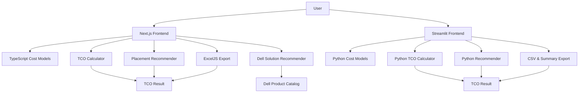
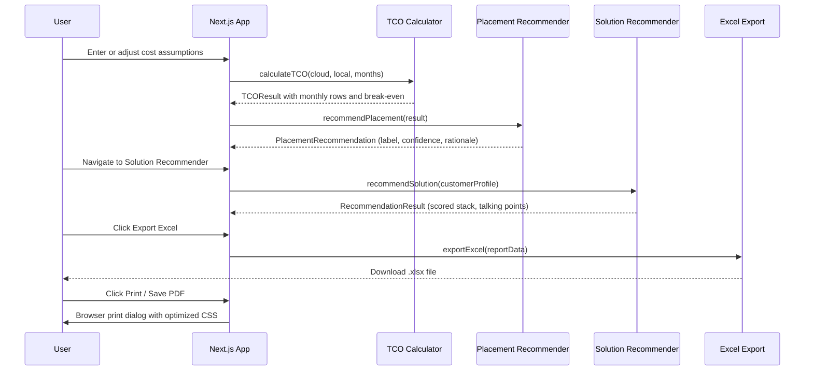
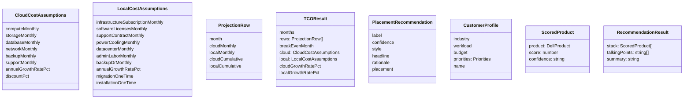
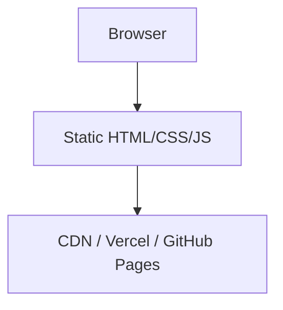
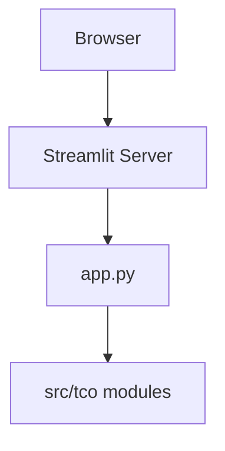

# Architecture

The project has two frontends — a modern **Next.js / React** application (primary) and a legacy **Streamlit** application — both powered by a shared, tested calculation engine.

## High-Level View



## Runtime Flow



## Layers

| Layer | Implementation | Notes |
|-------|---------------|-------|
| Presentation | Next.js pages + React components | shadcn/ui, Recharts, MapLibre GL |
| Legacy Presentation | Streamlit (`app.py`) | Plotly charts, native widgets |
| Application Orchestration | `page.tsx` (React state) / `app.py` | Collects inputs, calls domain modules |
| Domain (TypeScript) | `lib/tco/`, `lib/solutions/` | TCO calculation, recommendation, Dell scoring |
| Domain (Python) | `src/tco/` | Same logic, independently tested |
| Export | `lib/excel-export.ts`, `src/tco/export.py` | ExcelJS workbook, CSV generation |

## Data Model



## Frontend Module Structure

```
frontend/src/
├── app/
│   ├── layout.tsx                 # Root layout, font loading
│   └── page.tsx                   # Main page — state, section routing, preset management
├── components/
│   ├── sidebar.tsx                # Collapsible nav (Dashboard, Cost Inputs, Recommender, Report)
│   ├── sections/
│   │   ├── dashboard-section.tsx  # KPI grid + 10 chart components + insights panel
│   │   ├── inputs-section.tsx     # Cloud & local cost input cards with live preview
│   │   ├── solution-recommender-section.tsx  # Profile config, radar chart, scored stack
│   │   └── report-section.tsx     # Document-style report with print CSS
│   ├── charts/                    # 10 Recharts components (cumulative, delta, donut, map, etc.)
│   ├── ui/                        # shadcn/ui primitives
│   ├── metric-card.tsx            # KPI display card with sparkline
│   ├── key-insights-panel.tsx     # Auto-generated narrative insights
│   └── recommendation-priority-table.tsx  # Ranked workload table
├── lib/
│   ├── tco/
│   │   ├── models.ts             # TypeScript interfaces for cost assumptions
│   │   ├── calculator.ts         # calculateTCO() — monthly projection engine
│   │   ├── recommender.ts        # recommendPlacement() — rule-based placement
│   │   ├── presets.ts            # 3 built-in scenario presets
│   │   └── dashboard-data.ts     # Data transformers for chart components
│   ├── solutions/
│   │   ├── solution-catalog.ts   # Dell product catalog, industries, talking points
│   │   └── solution-recommender.ts  # Weighted scoring across 4 dimensions
│   ├── excel-export.ts           # 5-sheet ExcelJS workbook generator
│   └── utils.ts                  # cn() class merge, formatMoney()
```

## Key Design Decisions

| Decision | Rationale |
|----------|-----------|
| Next.js static export | Zero backend — deployable on any static host, Vercel, or offline |
| Manual cost inputs | Keeps assumptions transparent, no credentials required |
| Separate TypeScript engine | Same logic as Python, type-safe, runs client-side |
| Separate Python engine | Independently tested, used by Streamlit frontend |
| Recharts over Plotly | Lighter bundle, better React 19 integration |
| MapLibre GL | Open-source vector map, no API key needed |
| ExcelJS over SheetJS | Better styling, number formatting, and sheet control |
| shadcn/ui | Accessible Radix primitives with full Tailwind customization |
| Print CSS over server-side PDF | No backend dependency, user controls output via browser |
| Rule-based recommender | Auditable, no ML model, no hidden inputs |

## Deployment Model

The Next.js frontend builds to a fully static site:



Build command: `npm run build` — output directory: `frontend/out/`

The Streamlit app runs locally or on any Streamlit-compatible host:


