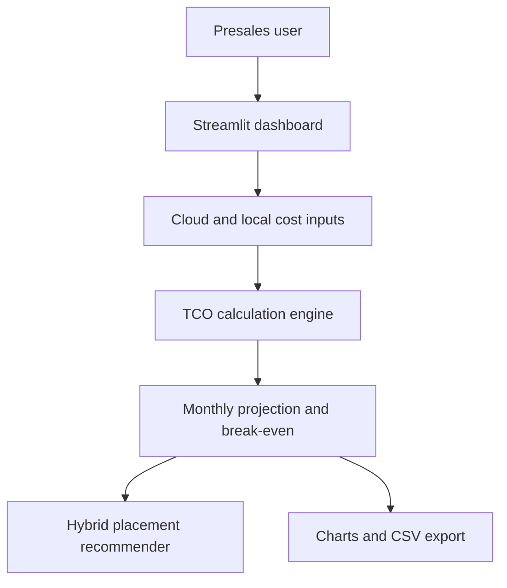

# Presentation Deck: TCO Repatriation Dashboard

Subtitle:

```text
A presales decision-support tool for cloud, local infrastructure, and hybrid workload placement
```

Target audience:

```text
Dell Presales Academy recruiters and Inside Product Solution Architect interviewers
```

Recommended length:

```text
8-10 minutes, plus Q&A
```

---

## Slide 1: Title

**TCO Repatriation Dashboard**

A presales project that connects infrastructure architecture to business value.

Presenter:

```text
[Your Name]
Inside Product Solution Architect candidate
```

Speaker notes:

```text
This project is not just a coding exercise. I built it to demonstrate how I would support a customer conversation: understand the business problem, quantify the impact, explain options, and recommend a practical next step.
```

---

## Slide 2: The Customer Problem

**Cloud-first does not always mean cloud-only.**

Many organizations adopted public cloud for speed and flexibility. Over time, predictable workloads can become expensive, especially when storage, backup, compute, support, and data growth compound over multiple years.

Customer question:

```text
Should we keep this workload in public cloud, move it local, or use a hybrid approach?
```

Speaker notes:

```text
The business pain is not simply "cloud is expensive." The real issue is workload placement. Some workloads belong in cloud. Some may be better local. Most real customers need a rational hybrid discussion.
```

---

## Slide 3: Why This Matters In Presales

**A presales architect must translate technology into business outcomes.**

This project shows:

- Discovery thinking.
- TCO and ROI framing.
- Technical tradeoff analysis.
- Hybrid placement strategy.
- Clear communication for technical and financial stakeholders.

Speaker notes:

```text
An inside product solution architect needs to do more than explain products. They need to qualify the problem, shape the solution, and help the customer understand the financial and operational impact of the decision.
```

---

## Slide 4: Solution Overview

**The dashboard compares two cost paths.**

Path 1:

```text
Stay in public cloud
```

Path 2:

```text
Use local infrastructure on a subscription model
```

The app calculates:

- Multi-year TCO.
- Break-even month.
- Net savings.
- Monthly run-rate delta.
- Hybrid placement recommendation.

Speaker notes:

```text
I intentionally kept the model transparent. The customer can see the assumptions, change the inputs, challenge the recommendation, and export the projection.
```

---

## Slide 5: Demo Architecture



Speaker notes:

```text
The code is structured like a real solution: UI, calculation engine, recommender, export, tests, and documentation. I separated the financial logic from the UI so it can be tested and reused.
```

---

## Slide 6: What The Dashboard Shows

Core outputs:

- Public cloud TCO.
- Local infrastructure TCO.
- Net savings.
- Break-even month.
- Cumulative TCO chart.
- Cost composition chart.
- Monthly and cumulative delta charts.
- CSV export.

Speaker notes:

```text
The goal is to help a customer understand not just the final number, but the journey. A lower monthly local run-rate may still be a bad decision if the migration cost delays payback too far.
```

---

## Slide 7: Hybrid Recommendation

**The recommendation avoids fake precision.**

It does not say:

```text
Move exactly 43% on-prem.
```

It says:

```text
Cloud-first, hybrid candidate, repatriation candidate, or validate assumptions.
```

Why this matters:

- Real customers rarely move everything.
- Workload placement depends on cost, risk, operations, data gravity, and elasticity.
- A conservative recommendation is more credible than an overconfident one.

Speaker notes:

```text
I built the recommender as a transparent rule-based system. That is important in presales because customers need to trust the logic, not just see a black-box answer.
```

---

## Slide 8: Dell-Aligned Thinking

This project aligns with public Dell Technologies themes:

- Human progress through useful technology.
- Simplified technology consumption.
- Hybrid and multicloud workload placement.
- Modern data center and edge readiness.
- Cost-aware AI and infrastructure decisions.

Speaker notes:

```text
I am not presenting this as a Dell product. I am showing that I understand the kind of customer conversations Dell is positioned to lead: hybrid infrastructure, consumption models, private cloud, edge, data protection, and AI infrastructure economics.
```

Source notes:

- Dell describes its purpose around driving human progress through technology.
- Dell APEX messaging emphasizes simplified technology consumption and flexible as-a-Service models.
- Dell modern data center messaging discusses workloads across on-premises, cloud, and edge.
- Dell AI messaging highlights cost, security, and data challenges around enterprise AI.

---

## Slide 9: Presales Skills Demonstrated

| Skill | Evidence In Project |
| --- | --- |
| Discovery | Input model separates cloud and local cost drivers |
| Business value | TCO, savings, payback, break-even |
| Architecture | Modular design and hybrid placement logic |
| Communication | Executive summary, charts, report notes |
| Credibility | Transparent formulas and test coverage |
| Customer empathy | Conservative recommendation and assumption validation |

Speaker notes:

```text
The project is meant to show how I think as a solution architect: technical enough to build the model, commercial enough to explain the value, and careful enough not to oversell the recommendation.
```

---

## Slide 10: Live Demo Flow

Demo sequence:

1. Choose a preset.
2. Show TCO headline metrics.
3. Explain break-even.
4. Open charts.
5. Open Recommendation tab.
6. Show assumptions.
7. Export CSV.

Speaker notes:

```text
I would keep the live demo short. The purpose is not to click every field. The purpose is to show that the tool supports a customer conversation from cost pain to next action.
```

---

## Slide 11: What I Would Improve Next

If this became a real presales asset, I would add:

- PDF executive report.
- Scenario comparison.
- Customer-ready discovery checklist.
- Optional billing CSV import.
- Dell solution mapping layer.
- Saved scenarios for account teams.

Speaker notes:

```text
I avoided overbuilding the MVP. The strongest next step would be turning the current output into a polished customer-facing report and adding a structured discovery workflow.
```

---

## Slide 12: Closing

**This project demonstrates the bridge I want to build in the role.**

```text
Technical architecture + customer discovery + financial value + clear recommendation
```

Closing statement:

```text
I built this to show how I would approach presales: understand the customer's business pressure, translate it into a technical and financial model, and guide them toward a practical solution.
```

