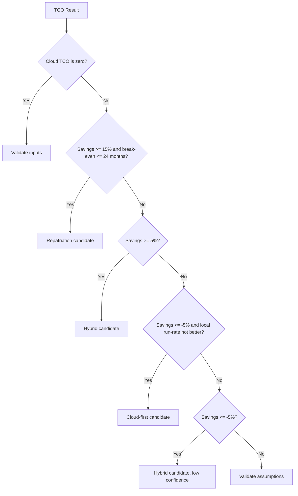

# Hybrid Placement Recommender

## Purpose

The recommender converts the current TCO comparison into a placement suggestion. It helps a normal user answer:

```text
Should this workload stay in cloud, move local, or use a hybrid approach?
```

The recommender is rule-based. It is not an AI model and it does not use hidden inputs.

## Inputs Used

The recommender uses only the existing TCO result:

- Public cloud TCO.
- Local infrastructure TCO.
- Savings percent.
- Break-even month.
- Monthly run-rate delta.
- Dominant cloud cost category.
- Cloud discount percent.

## Outputs

| Field | Meaning |
| --- | --- |
| Label | Main recommendation |
| Confidence | High, Medium, or Low |
| Headline | Plain-language summary |
| Why this result | Rationale bullets |
| What to do first | Practical next-step bullets |

## Recommendation Labels

| Label | Meaning |
| --- | --- |
| Repatriation candidate | Moving predictable workloads local is economically supported |
| Hybrid candidate | Selective placement is more credible than all-in cloud or all-in local |
| Cloud-first candidate | The current cost case does not justify repatriation |
| Validate assumptions | The result is too close or incomplete for a strong recommendation |

## Rule Summary



## Dominant Cost Category Adjustment

After the main recommendation is selected, the recommender checks whether one cloud category is at least 35 percent of public cloud baseline spend.

If storage or backup dominates and the recommendation is not cloud-first:

```text
Prioritize storage-heavy or backup-heavy workloads for local evaluation.
```

If compute dominates and cloud discount is at least 10 percent:

```text
Keep bursty or elastic compute cloud-side unless utilization is consistently high.
```

If database dominates and the recommendation is not repatriation:

```text
Keep managed databases in cloud unless operations ownership is clearly covered.
```

## Confidence Meaning

| Confidence | Meaning |
| --- | --- |
| High | The economics and timing point clearly in one direction |
| Medium | The direction is useful, but a selective approach is safer |
| Low | The result is close, incomplete, or sensitive to assumptions |

## Why The Recommender Is Conservative

The app does not know:

- Application architecture.
- Latency requirements.
- Compliance constraints.
- Internal operations maturity.
- Exact migration complexity.
- Contract terms.
- Current cloud reserved commitment details beyond the discount field.

Because of that, the recommender avoids pretending to know exact migration percentages.

## Test Coverage

The verified recommender paths are:

- Strong savings and early break-even returns `Repatriation candidate`.
- Positive savings but weaker timing returns `Hybrid candidate`.
- Local cost is worse and local run-rate is not better returns `Cloud-first candidate`.
- Close results return `Validate assumptions`.

