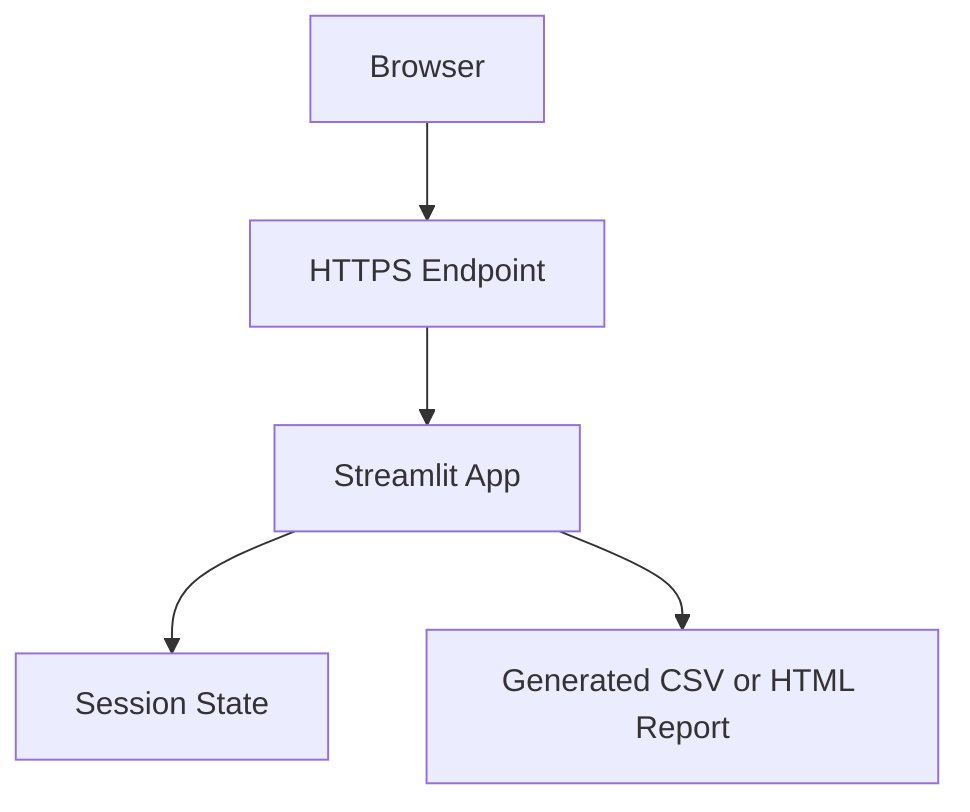
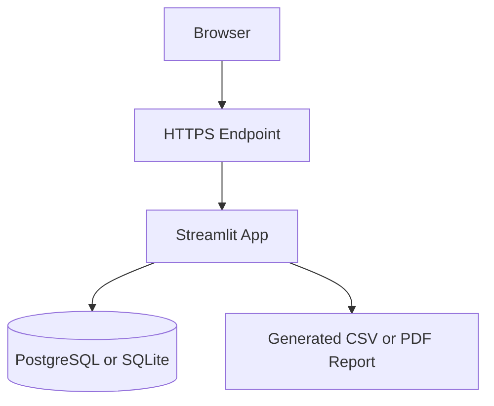

# TCO Repatriation Dashboard Deployment Plan

## Deployment Recommendation

For the MVP, use the simplest managed deployment that can run a Streamlit app. The app should not need a database, queue, cache, or object storage in the first version.

Decision path:

```text
MVP + tight budget + no ops -> simple managed app hosting
```

## Topology



If saved scenarios are added:



## Environments

| Environment | Purpose | Data |
| --- | --- | --- |
| Local | Build and test formulas | Synthetic scenarios |
| Demo | Shareable portfolio or presales demo | Synthetic or anonymized scenarios |
| Production | Only if real users use the app | Customer scenarios with auth and backups |

## CI/CD Workflow

1. Open pull request.
2. Run `pytest`.
3. Run linting and formatting if configured.
4. Build or install dependencies.
5. Deploy demo environment.
6. Smoke test dashboard loads and sample scenario calculates.
7. Promote to production only after manual check.

## Operational Cost Estimate

| Component | MVP | Productized Version | Notes |
| --- | --- | --- | --- |
| App hosting | Low or free-tier eligible | Low to moderate | Depends on host and traffic |
| Database | None | Managed PostgreSQL | Needed only for saved scenarios |
| Monitoring | Provider logs | Error tracking and uptime checks | Add when external users exist |
| Storage | None | Object storage optional | Needed only for generated reports |
| Email/auth | None | Auth provider | Needed for multi-user SaaS |

Avoid committing to exact provider prices in the app documentation because platform pricing changes. Check provider pricing before any production deployment.

## Security Plan

MVP:

- Do not store customer billing data by default.
- Do not ask for AWS or OCI credentials.
- Use synthetic demo scenarios.
- Validate all numeric input ranges.
- Display a planning-estimate disclaimer.

Production:

- Add authentication.
- Encrypt database storage at rest through managed provider.
- Use HTTPS only.
- Add audit logs for scenario creation, export, and deletion.
- Add tenant separation if multiple customer accounts exist.
- Add retention and deletion controls.

## Backup and Recovery

MVP without database:

- Source code in Git.
- No persistent customer data to back up.

With saved scenarios:

- Daily automated database backups.
- Point-in-time recovery if supported.
- Quarterly restore test.
- Documented restore procedure.

Suggested targets for production:

| Target | Value |
| --- | --- |
| RTO | 4 hours for early production |
| RPO | 24 hours for early production |
| Backup retention | 14 to 30 days |

## Rollback Plan

- Keep previous deploy available through hosting platform if supported.
- Use backward-compatible data migrations.
- For a stateless MVP, rollback is redeploying the previous working version.
- For database-backed version, avoid destructive migrations until export and restore are tested.

