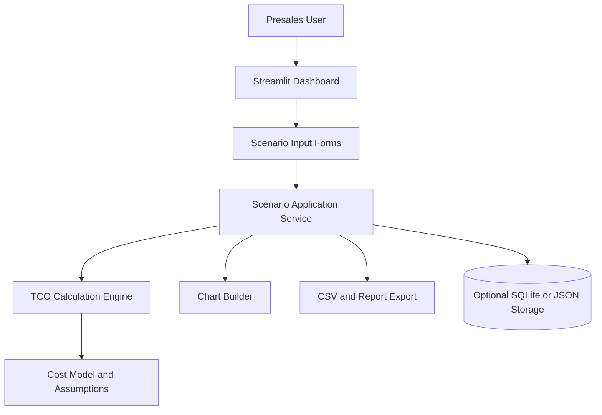
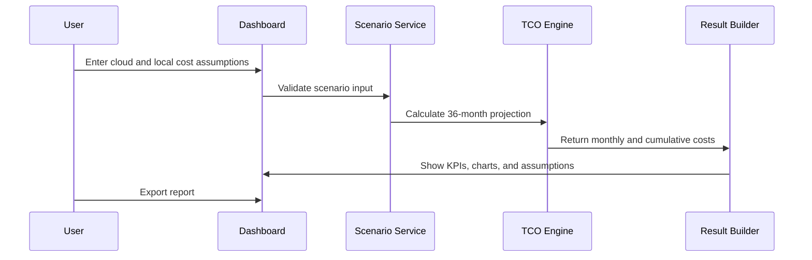
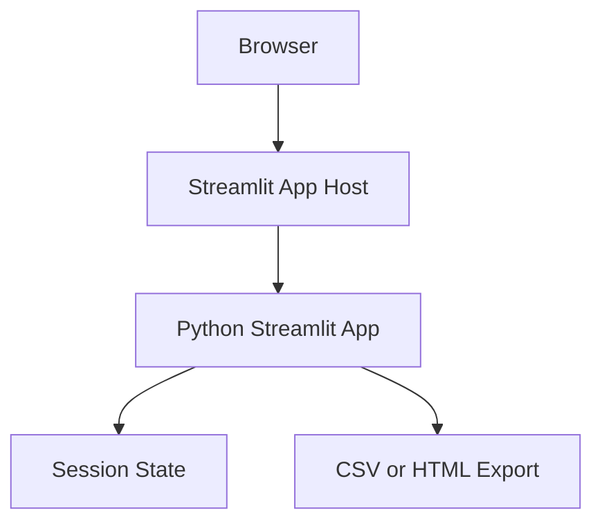

# TCO Repatriation Dashboard Technical Architecture Design

## 1. Project Overview

The project is a presales-focused web dashboard that compares the 3-year total cost of ownership for two infrastructure strategies:

- Staying in public cloud, such as AWS or OCI.
- Moving selected workloads back to local infrastructure purchased on a subscription or managed infrastructure model.

The product should help a presales engineer, cloud consultant, or infrastructure account team have a credible business conversation with technical and financial stakeholders. The main value is not just the calculator. The value is a transparent, explainable comparison with assumptions, charts, break-even analysis, and exportable results.

## 2. Requirements Analysis

### Confirmed Facts

- Users need to enter current monthly public cloud compute and storage costs.
- The dashboard calculates a 3-year TCO comparison.
- The two comparison paths are public cloud continuation versus local infrastructure subscription.
- The first version should be simple enough for a portfolio or presales demo.
- The app can be built with React or Python Streamlit.

### Assumptions

- MVP is single-user or demo-user only.
- No sensitive production billing files are required for the first version.
- User-provided cloud costs are the source of truth for the first version.
- The first version should avoid live AWS or OCI billing API integrations.
- The dashboard should show formulas and assumptions so the output is defensible.
- Local infrastructure is modeled as a subscription, not pure hardware capex, because that matches the prompt.

### Open Questions

- Should this be a personal portfolio project, an internal sales tool, or a customer-facing SaaS?
- Should exports be PDF, CSV, or both?
- Should scenarios be saved locally, in a database, or not saved at all?
- Should the local infrastructure model include power, cooling, rack space, support, and IT labor from day one?
- Should the model include financial concepts like net present value and discount rate?

### Core User Roles

| Role | Goal | MVP Permission |
| --- | --- | --- |
| Presales engineer | Build a customer-facing cost comparison quickly | Create and export scenarios |
| IT finance stakeholder | Inspect assumptions and compare totals | View report |
| Infrastructure decision maker | Understand break-even and risk tradeoffs | View dashboard and summary |

### Core Features

| Feature | MVP Scope |
| --- | --- |
| Scenario input | Manual entry of cloud and local cost assumptions |
| 36-month projection | Monthly and cumulative TCO calculation |
| Break-even analysis | First month where local cumulative cost is lower than cloud |
| Savings summary | 3-year savings, savings percent, and monthly delta |
| Charts | Line chart for cumulative TCO and stacked bar chart by category |
| Assumption transparency | Show formulas and line items used |
| Scenario presets | Storage-heavy, compute-heavy, steady-state VM estate |
| Export | CSV first, PDF/HTML report second |

### Non-Functional Requirements

| Area | Target |
| --- | --- |
| Performance | Dashboard recalculates instantly for one scenario |
| Availability | Portfolio/demo app can tolerate simple hosting availability |
| Security | No customer secrets or cloud credentials in MVP |
| Privacy | Avoid storing customer billing data unless explicitly enabled |
| Reliability | Deterministic calculation engine with unit tests |
| Maintainability | Keep TCO formulas in a separate domain module |
| Cost | MVP hosting should stay near free or low monthly cost |

## 3. Architecture Design

### Recommended Architecture Style

Use a modular monolith for the MVP.

This keeps the app simple while separating the most important responsibility: the TCO calculation engine. The UI can change later, but the formula engine should remain testable and reusable.

```text
Presentation -> Streamlit dashboard
Application  -> Scenario orchestration, export workflow
Domain       -> TCO formulas, validation, break-even logic
Infrastructure -> Local files or SQLite for saved scenarios, optional report export
```

### Logical Architecture



### Domain Model

| Entity | Description |
| --- | --- |
| Scenario | Named comparison for one customer or workload |
| CloudCostAssumptions | Compute, storage, database, network, backup, support, growth rate |
| LocalCostAssumptions | Subscription, support, power, cooling, rack, labor, migration |
| ProjectionMonth | Month number, cloud cost, local cost, cumulative totals |
| TCOResult | 3-year totals, savings, savings percent, break-even month |
| ExportReport | Generated snapshot of scenario inputs and outputs |

### Calculation Flow



### Data Architecture

MVP can start stateless:

- Keep scenario values in Streamlit session state.
- Export CSV for persistence.
- No login and no database required.

If saved scenarios are needed:

- Use SQLite locally for a portfolio demo.
- Use PostgreSQL if deployed as a multi-user web app.

Suggested data files or tables:

- `scenarios`
- `cost_assumptions`
- `projection_rows`
- `exports`

### API Design

No external API is required in the first version.

If a React frontend is added later, expose a small REST API:

| Endpoint | Purpose |
| --- | --- |
| `POST /api/scenarios/calculate` | Calculate TCO without saving |
| `POST /api/scenarios` | Save a scenario |
| `GET /api/scenarios/{id}` | Load saved scenario |
| `GET /api/scenarios/{id}/export` | Download report |

API rules for future use:

- Validate all numeric inputs.
- Use idempotent calculation endpoints.
- Return structured errors with field-level messages.
- Version API under `/api/v1` once external users exist.

## 4. Technology Selection

Recommended MVP stack:

- Python 3.12+
- Streamlit for the dashboard
- pandas for projection tables
- Plotly for charts
- Pydantic or dataclasses for cost model validation
- pytest for calculation tests
- SQLite only if saved scenarios are needed

Why this is the best first version:

- The hard part is the financial model, not the UI framework.
- Python is strong for calculations, tables, and charting.
- Streamlit lets you build a clean executive dashboard quickly.
- The project remains easy to explain in interviews and demos.

## 5. Deployment Plan

### MVP Deployment



Recommended path:

1. Build and run locally first.
2. Deploy the demo app to a simple managed app platform.
3. Add database-backed saved scenarios only after the calculator and report are credible.

### Environments

| Environment | Purpose |
| --- | --- |
| Local | Development and model testing |
| Demo/Staging | Shareable version for portfolio or sales demo |
| Production | Only needed if real users and saved customer data are added |

### Observability

MVP:

- App startup logs.
- Error logs from hosting provider.
- Unit tests for formulas.

Production:

- Request/error monitoring.
- Audit logs for saved customer scenarios.
- Backup monitoring if database is added.

## 6. Key Technical Solutions

### TCO Formula Model

Use a monthly projection because decision makers care about break-even timing, not only final totals.

Cloud monthly cost:

```text
cloud_monthly_cost =
  compute_cost
  + storage_cost
  + database_cost
  + network_egress_cost
  + backup_cost
  + support_cost
```

Cloud monthly projection:

```text
projected_cloud_month_cost =
  cloud_monthly_cost * (1 + annual_growth_rate) ^ (month / 12)
```

Local monthly cost:

```text
local_monthly_cost =
  infrastructure_subscription
  + software_licenses
  + support_contract
  + power_and_cooling
  + rack_or_datacenter
  + admin_labor
  + backup_and_dr
```

Local total:

```text
local_3_year_tco =
  one_time_migration_cost
  + installation_services
  + sum(local_monthly_cost for months 1..36)
```

Savings:

```text
savings_amount = cloud_3_year_tco - local_3_year_tco
savings_percent = savings_amount / cloud_3_year_tco
```

Break-even month:

```text
first month where cumulative_local_cost <= cumulative_cloud_cost
```

### Sensitivity Analysis

Add simple sliders for assumptions that can change the conclusion:

- Cloud annual growth rate.
- Local infrastructure subscription amount.
- Migration cost.
- Admin labor cost.
- Storage growth.
- Discount rate for NPV.

### Report Output

The report should include:

- Executive summary.
- 3-year cloud TCO.
- 3-year local infrastructure TCO.
- Net savings or cost increase.
- Break-even month.
- Top assumptions.
- Risk notes.
- Detailed monthly table.

## 7. Risk Assessment

| Risk | Impact | Mitigation |
| --- | --- | --- |
| Oversimplified cloud cost model | Incorrect recommendation | Use transparent line items and assumptions |
| Hidden local costs ignored | Local option looks artificially cheap | Include labor, power, cooling, support, backup, and DR |
| Cloud discounts ignored | Cloud option looks artificially expensive | Add fields for committed-use discounts or negotiated discount |
| Migration cost underestimated | Break-even appears too early | Separate one-time migration and services costs |
| User treats estimate as a quote | Business trust risk | Label output as planning estimate, not procurement quote |
| Customer data stored insecurely | Compliance risk | Do not store data in MVP; add auth and encryption if saving scenarios |

## 8. Implementation Plan

### Phase 1: Calculator Core

- Define cost assumption models.
- Implement 36-month projection.
- Implement break-even calculation.
- Add unit tests for formulas.

### Phase 2: Dashboard MVP

- Build Streamlit input form.
- Add KPI summary cards.
- Add cumulative TCO line chart.
- Add monthly cost table.
- Add scenario presets.

### Phase 3: Presales Polish

- Add sensitivity controls.
- Add CSV export.
- Add HTML/PDF report export.
- Improve visual hierarchy and wording.
- Add disclaimer and assumptions panel.

### Phase 4: Optional Productization

- Add saved scenarios.
- Add login.
- Add PostgreSQL.
- Add team/workspace support.
- Add AWS Cost Explorer or OCI billing import.

## 9. Future Evolution

The MVP should not integrate directly with cloud billing APIs. After the model proves useful, the project can evolve in three directions:

- Presales demo tool: keep it simple, polished, and export-focused.
- SaaS product: add auth, saved scenarios, teams, database, and billing.
- Enterprise consulting tool: add AWS/OCI import, detailed workload templates, audit trails, and role-based access.

